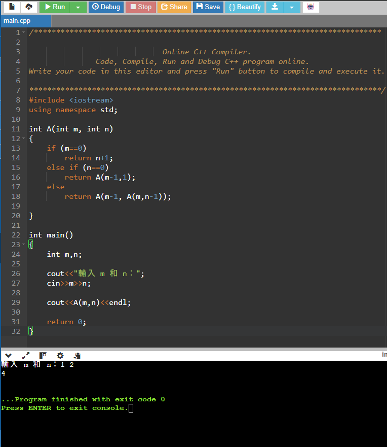

# Homework 1：Recursion

---

## 1. 解題說明

### Problem 1：Ackermann Function

#### 問題描述

這題要我們使用 C++ 寫出 Ackermann 函數，並且分別用遞迴和非遞迴兩種方法實作。

Ackermann 函數的公式如下：

$$
A(m,n)=
\begin{cases}
n+1 & m=0\\
A(m-1,1) & m>0,\ n=0\\
A(m-1,A(m,n-1)) & m>0,\ n>0
\end{cases}
$$

#### 解題方法

**遞迴版本：**

遞迴的寫法比較簡單，只要依照題目給的公式，用 if 和 else 判斷就可以了。

1. 如果 m = 0，就直接回傳 n + 1。
2. 如果 n = 0，就呼叫 A(m-1,1)。
3. 如果都不是，就先算 A(m,n-1)，再把結果帶入 A(m-1,結果)。

一直重複呼叫函數，直到 m = 0 才會開始回傳結果。

**非遞迴版本：**

非遞迴不能讓函數自己呼叫自己，所以我使用陣列來模擬 Stack。

用 top 記錄陣列目前的位置，再利用 while 迴圈重複進行計算，直到 Stack 裡面沒有資料為止。

### Problem 2：Powerset

#### 問題描述

這題要用遞迴的方式找出集合的所有子集合。

例如集合：

S = {a, b, c}

可以產生：

P(S) = {{}, {a}, {b}, {c}, {a,b}, {a,c}, {b,c}, {a,b,c}}

總共有 8 種子集合。

#### 解題方法

我使用兩個陣列，一個用來存放原本的元素，另一個記錄元素有沒有被選到。

- 0 代表不選。
- 1 代表選擇。

每次處理一個元素，都分成選擇和不選擇兩種情況，再繼續處理下一個元素。

當全部元素都處理完之後，就把目前選到的元素輸出。

---

## 2. 程式實作

### Problem 1：Ackermann Function

#### 遞迴版本（Recursive）

這個版本直接使用函數呼叫自己來進行計算。

```cpp
#include <iostream>
using namespace std;

int A(int m, int n)
{
    if (m==0)
        return n+1;
    else if (n==0)
        return A(m-1,1);
    else
        return A(m-1, A(m,n-1));
}

int main()
{
    int m,n;

    cout<<"輸入 m 和 n：";
    cin>>m>>n;

    cout<<A(m,n)<<endl;

    return 0;
}
```

#### 非遞迴版本（Nonrecursive）

這個版本使用陣列模擬 Stack，使用 while 迴圈來計算。

```cpp
#include <iostream>
using namespace std;

int A(int m,int n)
{
    int s[100000];
    int top=0;

    s[top]=m;

    while (top>=0)
    {
        m=s[top];
        top--;

        if (m==0)
        {
            n=n+1;
        }
        else if (n==0)
        {
            n=1;
            top++;
            s[top]=m-1;
        }
        else
        {
            n=n-1;

            top++;
            s[top]=m-1;

            top++;
            s[top]=m;
        }
    }

    return n;
}

int main()
{
    int m,n;

    cout<<"請輸入 m 和 n：";
    cin>>m>>n;

    cout<<A(m,n)<<endl;

    return 0;
}
```

#### 程式說明

遞迴版本主要是利用函數自己呼叫自己，直接照公式寫出來。

非遞迴版本則是用陣列存放還沒處理的資料，再利用 top 控制資料的存入和取出。

兩種寫法都可以計算 Ackermann 函數，但是因為 Ackermann 函數的數字增加得很快，所以如果輸入太大的數字，可能會發生計算時間太長或程式無法正常執行的問題。

### Problem 2：Powerset

這題使用遞迴列出集合中所有可能的子集合。

```cpp
#include <iostream>
using namespace std;

char S[3] = {'a', 'b', 'c'};
int choose[3] = {0, 0, 0};

void Powerset(int i)
{
    if (i == 3)
    {
        cout << "{";

        for (int j = 0; j < 3; j++)
        {
            if (choose[j] == 1)
            {
                cout << S[j] << " ";
            }
        }

        cout << "}" << endl;
        return;
    }

    choose[i] = 0;
    Powerset(i + 1);

    choose[i] = 1;
    Powerset(i + 1);
}

int main()
{
    Powerset(0);

    return 0;
}
```

#### 程式說明

我先建立 S 陣列存放 a、b、c 三個元素，再使用 choose 陣列記錄哪些元素有被選擇。

程式會依序判斷每個元素要不要選，直到 i = 3 的時候，代表三個元素都已經處理完，就輸出目前的集合。

---

## 3. 效能分析

### Problem 1：Ackermann Function

#### 時間複雜度

Ackermann 函數的計算次數會隨著 m 和 n 增加而快速變多。

遞迴版本需要一直呼叫函數，而非遞迴版本雖然改成 while 迴圈，但還是需要進行大量計算。

因為這個函數成長速度非常快，所以沒辦法用一般的 O(n) 或 O(n²) 來表示所有輸入的運算時間。

#### 空間複雜度

**遞迴版本：**

每次呼叫函數都需要使用記憶體保存資料，因此遞迴越深，使用的空間也會越多。空間需求和最大的遞迴深度有關。

**非遞迴版本：**

使用大小為 100000 的陣列來儲存資料。

因為陣列大小是固定的，所以以程式目前的寫法來看，額外空間複雜度為 O(1)。

不過這個陣列有容量限制，如果需要放入的資料太多，就可能超出陣列範圍。

### Problem 2：Powerset

#### 時間複雜度

因為每個元素都可以選或不選，所以如果有 n 個元素，就會有 2^n 種組合。

每次輸出時，還需要用 for 迴圈檢查 n 個元素。

所以時間複雜度為：

$$
O(n \times 2^n)
$$

#### 空間複雜度

程式需要使用陣列來記錄元素有沒有被選擇，而且遞迴也會使用額外的記憶體。

如果把程式改成可以處理 n 個元素的版本，空間複雜度為：

$$
O(n)
$$

---

## 4. 測試與驗證

### Problem 1：Ackermann Function

#### 測試一：遞迴版本

編譯程式：



輸入 m = 1、n = 2，結果為 4。

#### 測試二：非遞迴版本

編譯程式：

```shell
$ g++ ackermann_nonrecursive.cpp --std=c++21 -o nonrecursive.exe
$ .\nonrecursive.exe
請輸入 m 和 n：1 2
4
```

輸入相同的數字，得到的結果也是 4。

#### 測試三：比較兩種版本

| 輸入 | 遞迴結果 | 非遞迴結果 |
|---|---|---|
| A(1,2) | 4 | 4 |
| A(2,2) | 7 | 7 |
| A(3,2) | 29 | 29 |

以上是依照程式邏輯所得到的預期結果，繳交前需要實際執行並確認。

### Problem 2：Powerset

#### 測試一：集合 {a,b,c}

編譯與執行：

```shell
$ g++ powerset.cpp --std=c++21 -o powerset.exe
$ .\powerset.exe
{}
{c }
{b }
{b c }
{a }
{a c }
{a b }
{a b c }
```

#### 測試結果

因為集合有三個元素，所以應該會有：

$$
2^3=8
$$

個子集合。

程式預期會列出 8 個不同的子集合，符合題目的要求。

---

## 5. 申論及開發報告

### Problem 1：Ackermann Function

#### 遞迴與非遞迴的比較

這題我覺得遞迴版本比較容易理解，因為只要照著題目的公式寫，就可以完成程式。

非遞迴版本比較麻煩，需要自己使用陣列來模擬 Stack，還要控制 top 的位置。

不過透過非遞迴版本，可以更了解遞迴在執行時是怎麼儲存還沒完成的計算。

#### 遇到的問題

Ackermann 函數的數字增加得非常快。

例如輸入 A(7,0) 時，程式就無法在短時間內算出答案，而且使用 int 也無法儲存這麼大的結果。

因此這次主要使用比較小的數字進行測試，確認程式的邏輯是否正確。

### Problem 2：Powerset

#### 為什麼使用遞迴？

這題每個元素都有選和不選兩種情況，如果使用遞迴，就可以依序處理每個元素。

我覺得這種寫法比較容易理解，也不用自己列出所有的組合。

#### 學習心得

透過這次作業，我比較了解遞迴函數的運作方式。

第一題讓我練習將數學公式轉換成程式，也了解遞迴和非遞迴的差別。

第二題則讓我了解如何使用遞迴來列出所有可能的組合，以及如何使用陣列記錄每個元素的選擇狀態。
